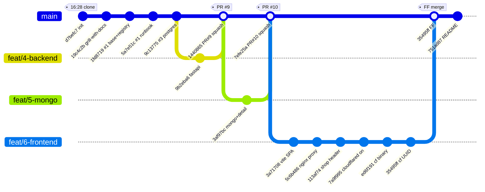

# 2026-05-24 Git Flow 정리

오늘 하루 동안 `Limseongin/weekend-k8s-lab` 저장소에서 진행한 브랜치 / 커밋 / 머지 흐름을 단계별로 정리한 문서입니다.
모든 시각은 KST(+0900) 기준이며, 커밋 해시는 `git log` 기준입니다.

---

## 1. 한눈에 보는 흐름 (Mermaid gitGraph)



> PR #9, #10은 GitHub 쪽에서 **squash merge**라 main에 새 커밋 하나로 떨어졌고,
> `feat/6-frontend`만 로컬에서 **fast-forward merge**라 별도 머지 커밋 없이 브랜치 끝 커밋이 main 끝으로 옮겨갔습니다.

---

## 2. ASCII 타임라인

```
시간    브랜치               커밋     내용                                    이슈/PR
─────  ──────────────────  ───────  ─────────────────────────────────────  ────────
16:28  (clone)             d7befc7  Initial commit                          —
18:23  main                19c4c2b  docs: grill-with-docs (CONTEXT, ADRs)   —
19:51  main                1fd8719  feat(k8s): namespace + registry         #1
20:15  main                5a7e51c  docs: insecure-registry runbook         #1
20:31  main                9c13775  feat(k8s): postgres statefulset+seed    #3
─────  ──────────────────  ───────  ─────────────────────────────────────  ────────
21:46  feat/4-backend      9b2eba6  feat(backend): FastAPI /api/products    #4
21:55  main  ⇐ squash      1440865  PR #9 머지 → main                       PR #9
─────  ──────────────────  ───────  ─────────────────────────────────────  ────────
22:04  feat/5-mongo        3af97bc  feat(mongo): SS + product detail        #5
22:08  main  ⇐ squash      7efe25a  PR #10 머지 → main                      PR #10
─────  ──────────────────  ───────  ─────────────────────────────────────  ────────
22:15  feat/6-frontend     3a71708  feat(frontend): React+Vite SPA          #6
22:41  feat/6-frontend     5c6b486  fix(frontend): nginx /api proxy         #6
23:04  feat/6-frontend     113af74  feat(frontend): shop header + SVG       #6
23:14  feat/6-frontend     7a9f995  feat(k8s): cloudflared on               #2
23:34  feat/6-frontend     ed6f191  fix(cloudflared): binary 직접 호출      #2
23:43  feat/6-frontend     35495ff  fix(cloudflared): tunnel UUID 주입      #2
23:51  main  ⇐ FF          35495ff  feat/6-frontend → main (fast-forward)   —
23:53  main                751ad87  docs: README + architecture + journal   —
```

---

## 3. 단계별 상세

### Stage 0 — Bootstrap (16:28 ~ 18:23)
- `d7befc7` **Initial commit** — `git clone`으로 받아온 baseline.
- `19c4c2b` **docs: grill-with-docs** — `CONTEXT.md`, `docs/adr/0001`, `0002`, `docs/agents/*`, `.claude/skills/*`, `.agents/skills/*`, `CLAUDE.md`, `skills-lock.json` 등 프로젝트 컨벤션/스킬 일괄 추가. **main에 직접 커밋.**

### Stage 1 — Cluster baseline + Registry (Issue #1, 19:51 ~ 20:15)
- `1fd8719` **feat(k8s): namespace + in-cluster registry** (`#1`)
  - 추가: `.gitignore`, `k8s/base/kustomization.yaml`, `k8s/base/namespace.yaml`, `k8s/base/registry/{deployment,kustomization,pv,pvc,service}.yaml`
- `5a7e51c` **docs: insecure-registry runbook** (`#1`)
  - 추가: `docs/runbooks/insecure-registry.md`
- 모두 main 직접 커밋. PR 없음.

### Stage 2 — Postgres StatefulSet (Issue #3, 20:31)
- `9c13775` **feat(k8s): postgres statefulset + seed job** (`#3`)
  - 추가: `k8s/base/postgres/{configmap-schema,kustomization,pv,secret,seed-job,service,statefulset}.yaml`
  - 수정: `k8s/base/kustomization.yaml`
- main 직접 커밋.

### Stage 3 — Backend FastAPI (Issue #4 → PR #9, 21:46 ~ 21:55)
- 브랜치 생성: `feat/4-backend` (from `9c13775`)
- `9b2eba6` **feat(backend): FastAPI /api/products + k8s manifests**
  - 추가: `backend/{.dockerignore,Dockerfile,app/__init__.py,app/main.py,requirements.txt}`
  - 추가: `docs/runbooks/backend-build-and-deploy.md`
  - 추가: `k8s/base/backend/{deployment,kustomization,service}.yaml`
  - 추가: `k8s/base/cloudflared/{configmap,deployment,kustomization,secrets.example}.yaml` (이때 cloudflared 매니페스트가 같이 들어왔지만 base kustomization 활성화는 보류)
  - 수정: `k8s/base/kustomization.yaml`
- **PR #9 squash merge** → main에 단일 커밋 `1440865`로 합쳐짐.
- 로컬은 `git pull --ff-only origin main`으로 main 동기화.

### Stage 4 — Mongo StatefulSet (Issue #5 → PR #10, 22:04 ~ 22:08)
- 브랜치 생성: `feat/5-mongo` (from `1440865`)
- `3af97bc` **feat(mongo): StatefulSet + product detail/reviews via /api/products/{id}**
  - 추가: `backend/app/seed_mongo.py`
  - 추가: `docs/runbooks/mongo-deploy.md`
  - 추가: `k8s/base/mongo/{kustomization,pv,secret,seed-job,service,statefulset}.yaml`
  - 수정: `backend/app/main.py`, `backend/requirements.txt`, `k8s/base/backend/deployment.yaml`, `k8s/base/kustomization.yaml`, `k8s/base/postgres/pv.yaml`
- **PR #10 squash merge** → main `7efe25a`.
- 다시 `pull --ff-only`로 main 동기화.

### Stage 5 — Frontend + Cloudflared 마무리 (Issues #6 + #2, 22:13 ~ 23:43)
긴 작업이라 같은 브랜치에서 여러 커밋을 쌓고 마지막에 한 번에 main으로 합쳤습니다.
- 브랜치 생성: `feat/6-frontend` (from `7efe25a`)

| 시각  | 커밋     | 메시지                                                       | 핵심 파일 |
|------|---------|--------------------------------------------------------------|-----------|
| 22:15 | 3a71708 | feat(frontend): React+Vite SPA + nginx static serve          | `frontend/**` 신규, `k8s/base/frontend/*`, `docs/runbooks/frontend-deploy.md` |
| 22:41 | 5c6b486 | fix(frontend): proxy `/api/*` to backend, v2                 | `frontend/nginx.conf`, `k8s/base/frontend/deployment.yaml` |
| 23:04 | 113af74 | feat(frontend): shop-style header + inline SVG thumbnail, v3 | `frontend/src/components/{CameraIcon,Layout}.tsx`, Catalog/ProductDetail/main 수정 |
| 23:14 | 7a9f995 | feat(k8s): enable cloudflared in base kustomization          | `k8s/base/kustomization.yaml` |
| 23:34 | ed6f191 | fix(cloudflared): invoke binary directly, image 2026.5.0     | `k8s/base/cloudflared/{configmap,deployment,secrets.example}.yaml` |
| 23:43 | 35495ff | fix(cloudflared): pass tunnel UUID via `$(VAR_NAME)`         | `k8s/base/cloudflared/{deployment,secrets.example}.yaml` |

- **로컬 fast-forward merge**로 main에 합침 (PR 없이 `git merge feat/6-frontend`).
  - main과 `feat/6-frontend`가 선형이라 머지 커밋 없이 main이 `35495ff`로 이동.

### Stage 6 — README 마무리 (23:53)
- `751ad87` **docs: write project README with architecture, layout, and build journal**
  - 수정: `README.md`
- main 직접 커밋.

---

## 4. 머지 전략 요약

| 머지       | 방식                | 결과 커밋   | 비고 |
|------------|---------------------|-------------|------|
| PR #9      | GitHub squash merge | `1440865`   | `feat/4-backend` 1커밋 → main 1커밋 |
| PR #10     | GitHub squash merge | `7efe25a`   | `feat/5-mongo` 1커밋 → main 1커밋 |
| `feat/6-frontend` → main | 로컬 fast-forward | `35495ff`   | 6커밋이 그대로 main 히스토리로 편입 |

> **왜 #6만 PR 없이 FF였나** — 작업 도중 cloudflared 운영 이슈가 같이 잡혀 commit이 6개로 늘어났고, 이미 main이 뒤처져 있지 않아 PR 없이 그대로 FF로 합쳤습니다. 다음에 같은 패턴이면 PR을 띄워 squash로 정리하는 편이 history가 깔끔할 것 같습니다.

---

## 5. 푸시(push) 시점

- 로컬에서 main 직접 커밋(Stage 0/1/2/6)은 만들자마자 바로 `git push origin main`.
- 브랜치 작업(Stage 3/4)은 `git push -u origin feat/X` → PR 생성 → GitHub에서 squash merge → 로컬 `git pull --ff-only`.
- Stage 5는 `git push -u origin feat/6-frontend`로 브랜치를 올린 뒤, 로컬에서 FF 머지 → `git push origin main`.

---

## 6. 이슈 ↔ 커밋 매핑

| Issue | 상태   | 관련 커밋 |
|-------|--------|-----------|
| #1    | OPEN   | `1fd8719`, `5a7e51c` |
| #2    | OPEN   | `7a9f995`, `ed6f191`, `35495ff` |
| #3    | OPEN   | `9c13775` |
| #4    | CLOSED | `1440865` (PR #9) |
| #5    | CLOSED | `7efe25a` (PR #10) |
| #6    | OPEN   | `3a71708`, `5c6b486`, `113af74` |
| #7, #8| OPEN   | (오늘 작업 없음) |
